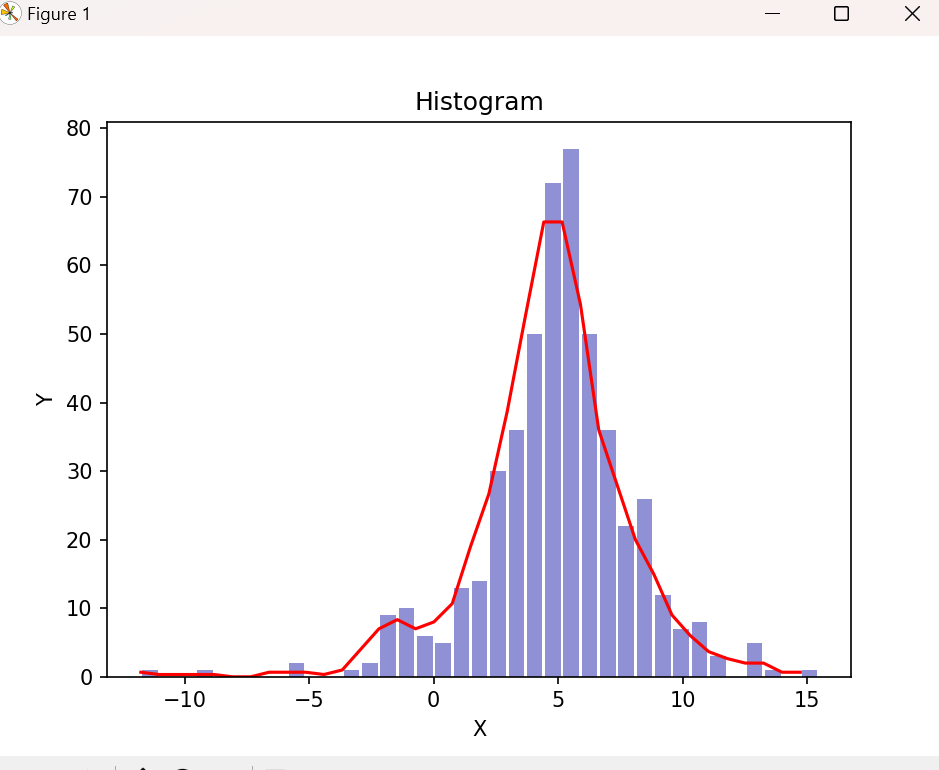

## 1.a) task

Use:
```
pip install matplotlib 
pip install numpy
```

## Do not forget to save the image "blue_circle_3.jpg" in the same directory as python file!

<p align="center">
  
</p>


## 9.b) task

Use:
```
pip install matplotlib 
pip install numpy
```

<p align="center">
  
</p>
